We benchmark and compare the most popular decimal crate
[`rust_decimal`](https://crates.io/crates/rust_decimal) and
this crate [`decimax`](https://crates.io/crates/decimax).
They are both fixed-size and floating-point decimal types.

The decimal in `rust_decimal` is 128-bit signed. While `decimax` also
supports 64-bit and 32-bit types besides 128-bit, of both signed and
unsigned. Here we use the 128-bit signed decimal only to compare.

We benchmark `+`, `*` and `/` operations. The `-` is same with `+` so we do not
benchmark it again.


# Environment

Versions:

- Rust: `cargo 1.93.0 (083ac5135 2025-12-15)`
- `criterion`: `0.7`
- `rust_decimal`: `1.40.0`
- `decimax`: `0.2.0`

Machines:

- Ubuntu 22.04 @AMD EPYC 9754
- Ubuntu 16.04 @Intel Xeon, 2500 MHZ
- MacOS 13.5 @Apple M1

The results varied at different Machines.
You are welcome to run the benchmark on your own computer:

```bash
git clone https://github.com/WuBingzheng/decimax.git
cd decimax
cargo bench
open target/criterion/report/index.html
```

If you're like me and don't like the chart lines' color in the results either,
you can use `cargo-criterion`:

```bash
cargo criterion
open target/criterion/reports/index.html
```

Running all the benchmark takes more than one hour and a half. You can
specify a subset:

```bash
cargo bench addition # run only addition
```

You can also set the sampling rate to reduce the time:

```bash
SAMPLE=10 cargo bench # run 1/10 tests for each case
```

Now let's begin the benchmark.


# Benchmark: addition

There are 2 execution branches in addition:

1. The scales of both operands are equal, then just add them;
2. The scales are not equal, then rescale the operand with the smaller scale
to the larger scale, then add them. However the rescaling may be overflow.
In this case, we need to find a middle scale and rescale both operands
towards it, then add them.

We design 2 test cases to cover the branches:

1. `pure`, the scales of both operands are equal.
2. `rescale`, the scales are not equal (we choose 0 and 15). The mantissa of
two operands increase by a factor of 10 at each step, starting from 1, up to
the maximum, which is 10^28 for `rust_decimal` and `10^36` for `decimax`.
During this incremental process, when the value exceeds a threshold, the
rescale of the first operand will overflow, then we need to find a middle
scale to rescale both operands.

Now let's see the results on 3 machines:

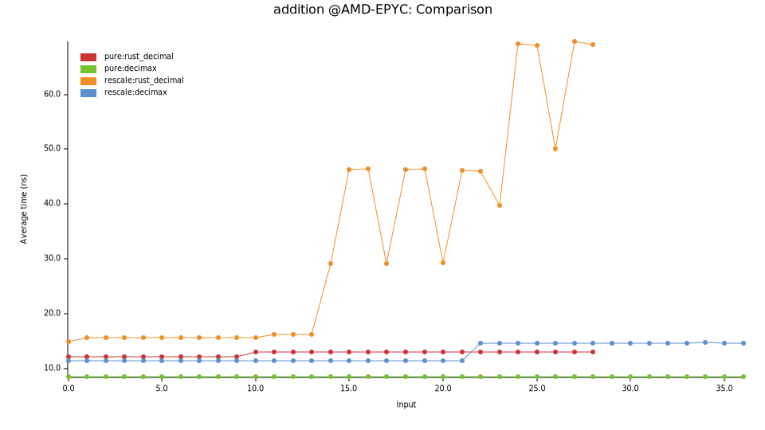
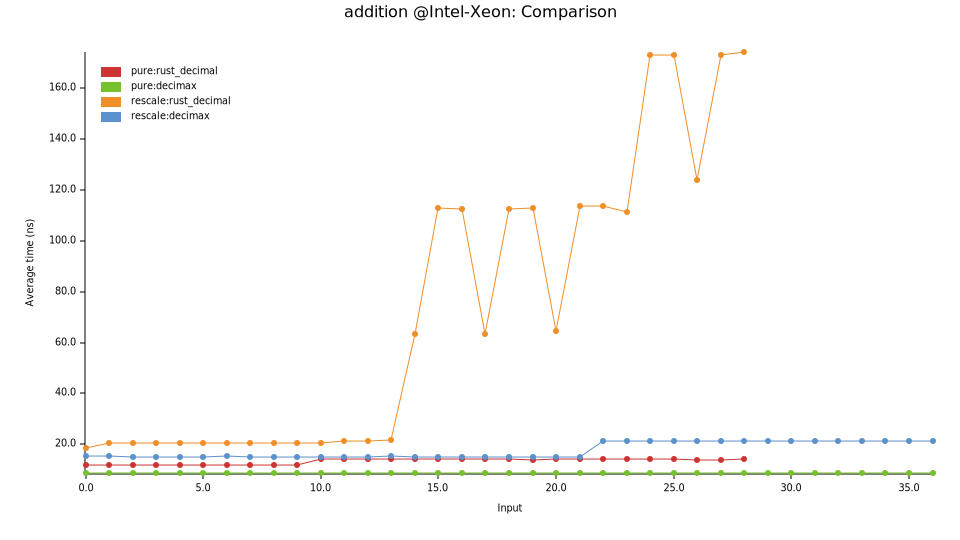
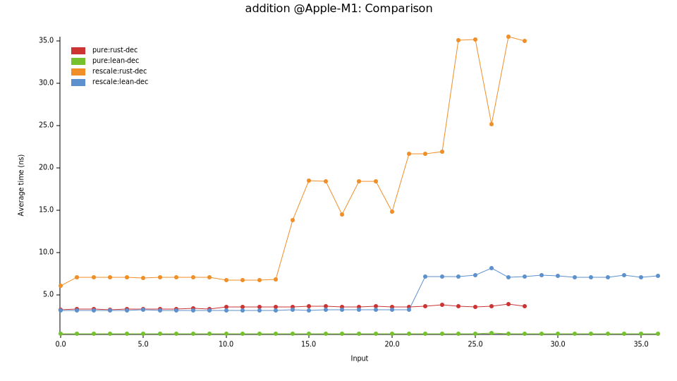

The y-axis represents execution time in nanoseconds (ns); higher values indicate
slower performance. The x-axis represents powers of 10 of the mantissa.

There are 4 lines in the chart: 2 crates * 2 test-cases.

Test case 1, `pure`, with same scales,

- `pure:rust_decimal` is stable and fast.

- `pure:decimax` is stable and even faster (4X faster at AMD, 3ns vs 12ns).

Test case 2, `rescale`, with different scales,

- `rescale:rust_decimal` has a jump at x=14. This is where the mantissa exceeds
the threshold, rescaling would overflow. Before the jump, it is stable; after
the jump, it becomes unstable and very very slow.

- `rescale:decimax` also has a jump but later, at x=22. This is because it
has more mantissa bits (122 bits vs 96 bits). Before the jump it's about 2X
faster than `rust_decimal` (8 ns vs 16 ns at AMD CPU), and after the jump
it becomes slower than before but still stable and much faster than `rust_decimal`.

Besides, the two `decimax` lines are longer than `rust_decimal` because we
have more mantissa bits too.


# Benchmark: multiplication

The decimal multiplication works as: 1. multiply the two mantissas, 2. add
the two scales. The two steps both may overflow. Regardless of which overflow
occurs, the product must be divided by some power of 10 to fit within the
decimal’s range. The performance impact of the division is the same in either
case. For simplicity and to stay consistent with the other operations tests,
we fix the scale and increase the mantissa.

Now let's see the results on 3 machines:

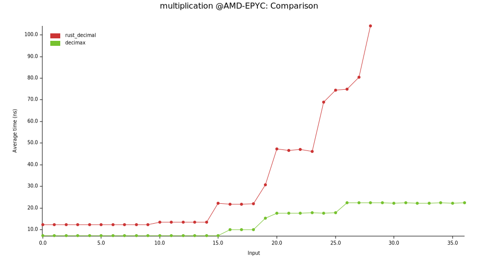
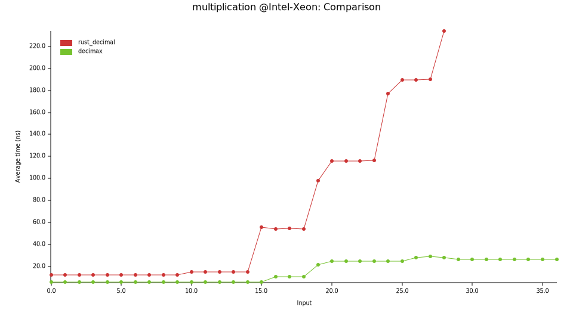
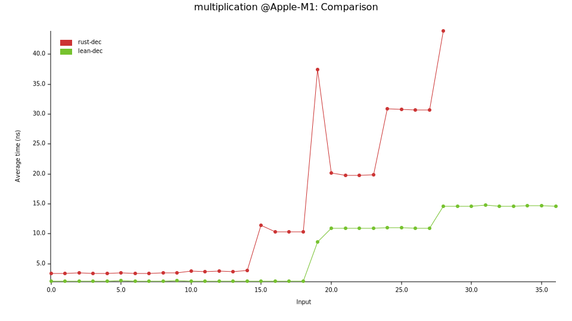

The y-axis represents execution time in nanoseconds (ns); higher values indicate
slower performance. The x-axis represents powers of 10 of the mantissa.

- `rust_decimal`, There is a jump at x=15, where overflow occurs. Before the jump,
it's stable, but after the jump it flies to the sky.

- `decimax`, The jump is at x=19, later than `rust_decimal`. The reason is
same with the addition test, because we have more mantissa bits. Before the
jump, it's stable and 2X faster (6 ns vs 12 ns as AMD CPU) than `rust_decimal`.
After the jump, it becomes slower than before but still stable and much faster
than `rust_decimal`.


# Benchmark: division by small

Division is complex. One of the reason is that division is slow, so we need
to optimize for different cases. One of the optimization is small divisor.
If the divisor fits in 32-bits, then we can do the division faster. So here
are 2 test cases for division: by small and by big divisors.

First, let's see the division by small in this section.

Note: the small and big means the mantissa, but not the decimal value.

There are some branches in decimal division:

1. The mantissa can be divided evenly. For example Dec128(6, 2) / Dec128(3, 2).
where in Dec128(m, s) the `m` is for mantissa and `s` for scale, so Dec128(6, 2)
is 0.06.

2. The mantissa can not be divided evenly, but it can be after rescaling.
For example Dec128(6, 2) / Dec128(12, 2), 6 / 12 is not even, but 60 / 12 is.
So the result is Dec128(5, 1), which is 0.5 . Unfortunately, it’s not
possible to know how much to rescale in advance, so we can only rescale as
much as possible first and then reduce it afterward. For the last example,
we first rescale the dividend to Dec128(6e33, 35), and do the mantissa
division, 6e33 / 12, get 5e32, so the decimal result is Dec128(5e32, 33).
This mantissa is too big, and big number is slow. So we need to reduce its
scale by 32, to make it to Dec128(5, 1). The reducing is also very slow.

3. The mantissa can not be divided evenly finally, even after rescaling.
For example Dec128(1, 2) / Dec128(3, 2), we get Dec128(3333{many}3333, 36).

In the evenly test cases, we use Dec128(10^8, 0) as divisor, and use
Dec128(10^X, 0) as dividends where X is in range from 0 to max. So it is
in branch-2 for X<=8, and branch-1 for X>8.

In the non-evenly test cases, we use Dec128(10^8 + 1, 0) as divisor, and
keep same for dividends.

Now let's see the results on 3 machines:

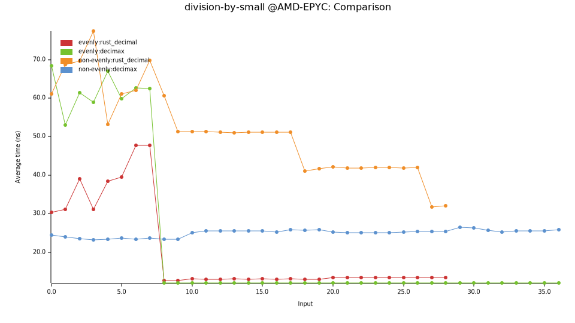
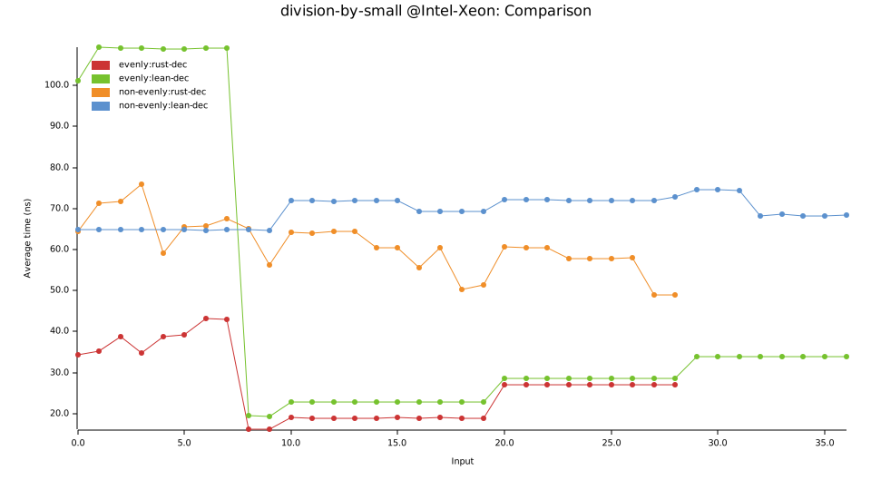
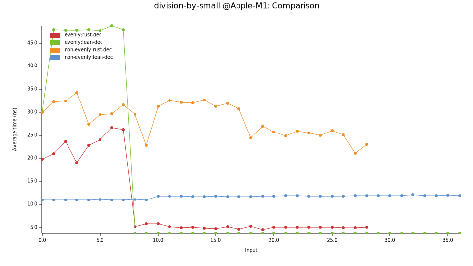

For the two `evenly` lines, there is a jump at x=8, as expected. Before the
jump, `decimax` is stable but much slower than `rust_decimal`. After the jump,
they perform differently at different machines.

For the two `non-evenly` lines, `decimax` is stable and faster.


# Benchmark: division by big

Now let's see the division by big.

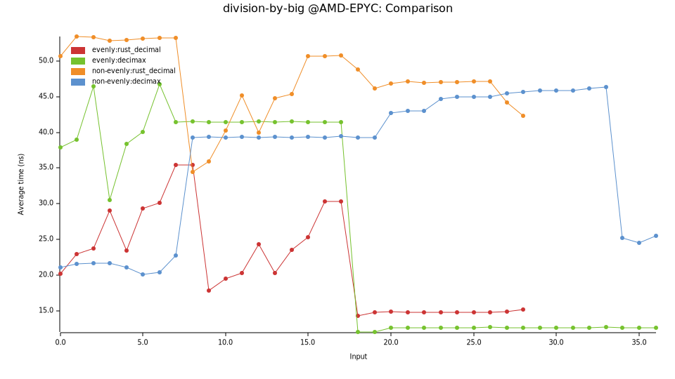
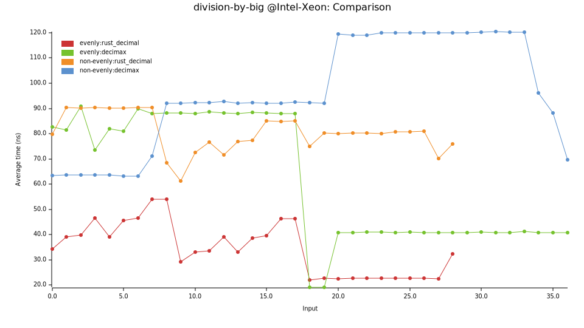
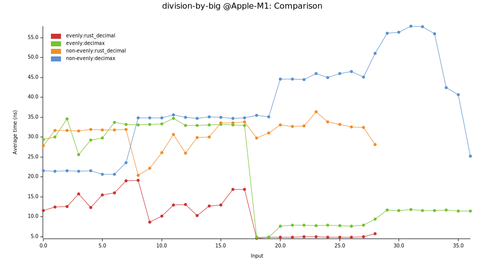

The results are similar with the above one, except that all becomes slower.


# Conclusion

Compared to `rust_decimal`, this crate `decimax` is more stable and much
faster in `+`, `-` and `*` operations. But it's slower in `/`. Division is complex
so we still has room for optimization.
